# Panduan Pengguna RAMCES

**Sistem Pemantauan Aset Alat Kerja — PT Kereta Api Indonesia (Persero)**

Panduan ini ditujukan untuk semua pengguna RAMCES: teknisi di lapangan, admin
wilayah, sampai pengelola pusat. Anda **tidak perlu latar belakang teknis** untuk
memakainya. Ikuti saja dari awal sampai akhir, atau langsung lompat ke bab yang
Anda butuhkan lewat daftar isi di bawah.

Setiap gambar di panduan ini diambil langsung dari aplikasi yang sedang berjalan,
jadi apa yang Anda lihat di layar akan sama persis dengan yang tertulis di sini.

---

## Daftar Isi

1. [Apa itu RAMCES](#1-apa-itu-ramces)
2. [Masuk ke RAMCES](#2-masuk-ke-ramces)
3. [Mengenal Layar RAMCES](#3-mengenal-layar-ramces)
4. [Dashboard — membaca kondisi armada](#4-dashboard--membaca-kondisi-armada)
5. [Kelola Data Alat Kerja — mendaftarkan aset](#5-kelola-data-alat-kerja--mendaftarkan-aset)
6. [Kelola Data Aset — mencari dan mencetak](#6-kelola-data-aset--mencari-dan-mencetak)
7. [Memperbarui kondisi, kalibrasi, dan mutasi](#7-memperbarui-kondisi-kalibrasi-dan-mutasi)
8. [Pantau Riwayat Aset](#8-pantau-riwayat-aset)
9. [Kelola Inventaris — suku cadang dan gudang](#9-kelola-inventaris--suku-cadang-dan-gudang)
10. [Proses Laporan — ekspor Excel dan PDF](#10-proses-laporan--ekspor-excel-dan-pdf)
11. [Pusat Data (khusus Super Admin)](#11-pusat-data-khusus-super-admin)
12. [Pulihkan Aset Afkir](#12-pulihkan-aset-afkir)
13. [Kartu Aset lewat QR (di lapangan)](#13-kartu-aset-lewat-qr-di-lapangan)
14. [Tips dan pemecahan masalah](#14-tips-dan-pemecahan-masalah)
15. [Glosarium](#15-glosarium)

---

## 1. Apa itu RAMCES

RAMCES adalah sistem untuk **mencatat dan memantau alat kerja ringan** milik PT
Kereta Api Indonesia — genset, mesin bor, *rail grinding machine*, *track
geometry trolley*, *impact wrench*, dan sejenisnya.

Sistem ini menjawab empat pertanyaan yang setiap hari ditanyakan orang:

| Pertanyaan | Bagian RAMCES yang menjawab |
|---|---|
| Alat ini sekarang siap dipakai atau rusak? | **Kondisi** (SO / TSO) |
| Alat ini sekarang ada di mana? | **Mutasi** (perpindahan antarlokasi) |
| Kalibrasinya masih berlaku? | **Kalibrasi** (beserta berkas sertifikat) |
| Suku cadangnya masih ada berapa? | **Inventaris** (stok per gudang) |

### Istilah yang wajib Anda kenal

RAMCES memakai istilah yang sama dengan yang dipakai di lapangan.

**Status kondisi alat kerja:**

| Singkatan | Arti | Maksudnya |
|---|---|---|
| **SO** | Siap Operasi | Alat sehat dan boleh dipakai |
| **TSO** | Tidak Siap Operasi | Alat rusak atau sedang diperbaiki |
| **AFKIR** | Afkir | Alat sudah dihapus dari daftar aktif (tidak dipakai lagi) |

**Struktur lokasi:**

| Istilah | Maksudnya |
|---|---|
| **DAOP** | Daerah Operasi (DAOP 1 Jakarta sampai DAOP 9 Jember) |
| **DIVRE** | Divisi Regional (wilayah Sumatera) |
| **UPT / Resort** | Unit kerja di bawah DAOP/DIVRE, contohnya `JR 1.7 Rangkasbitung` |
| **BALAIYASA** | **Bengkel**, bukan wilayah operasi |

> **Penting soal Balaiyasa.** Balaiyasa adalah tempat alat *diperbaiki*, bukan
> tempat alat *bermarkas*. Kalau DAOP 1 mengirim genset rusaknya ke Balaiyasa
> Cirebon, genset itu **tetap milik DAOP 1** dan tetap dihitung di laporan
> DAOP 1. Yang berubah hanya posisi fisiknya. Ini disengaja — supaya angka
> perbaikan sebuah DAOP tidak "hilang" begitu alatnya dikirim ke bengkel.

**Aset vs suku cadang** — dua hal yang berbeda dan dikelola terpisah:

- **Aset / alat kerja** — mesinnya sendiri. Punya ID unik, punya riwayat.
- **Suku cadang** — onderdil habis pakai (elektroda, gearcase, lampu LED).
  Dihitung per *gudang*, bukan per DAOP.

---

## 2. Masuk ke RAMCES

Masuk ke RAMCES dilakukan dalam **tiga langkah**.

### Langkah 1 — isi nama pengguna

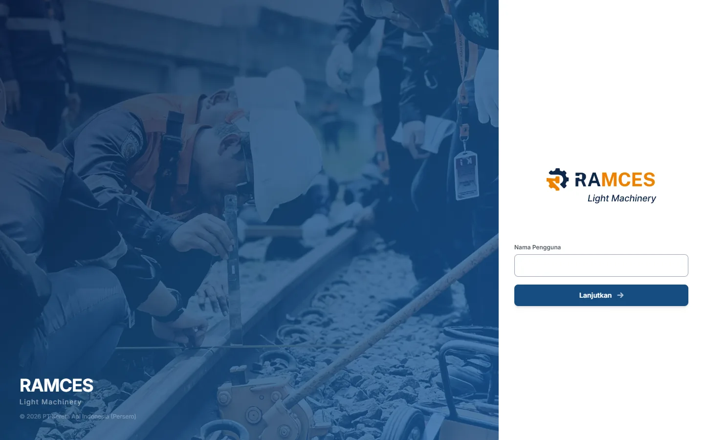

Ketik nama pengguna Anda, lalu tekan lanjut.

### Langkah 2 — pilih peran Anda

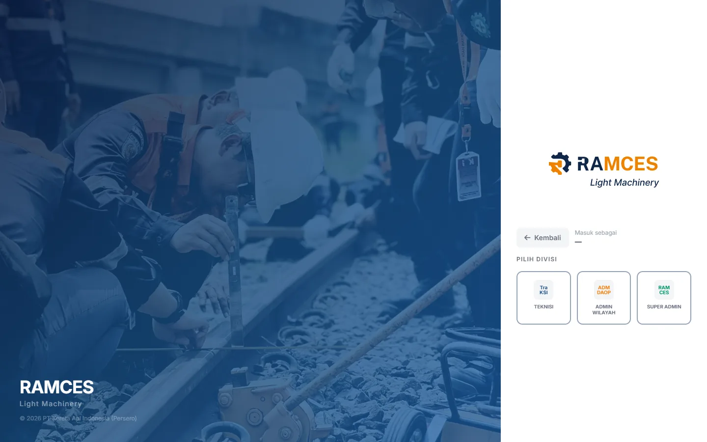

Pilih salah satu dari tiga peran:

| Peran | Untuk siapa | Bisa apa saja |
|---|---|---|
| **TEKNISI** | Petugas lapangan | Melihat data dan melaporkan kondisi alat |
| **ADMIN WILAYAH** | Admin DAOP/DIVRE | Semua di atas, **ditambah** menambah, mengubah, dan memutasi aset — **hanya di wilayahnya sendiri** |
| **SUPER ADMIN** | Pengelola pusat | Semua di atas, **ditambah** Pusat Data dan Pulihkan Aset Afkir, tanpa batasan wilayah |

### Langkah 3 — pilih wilayah

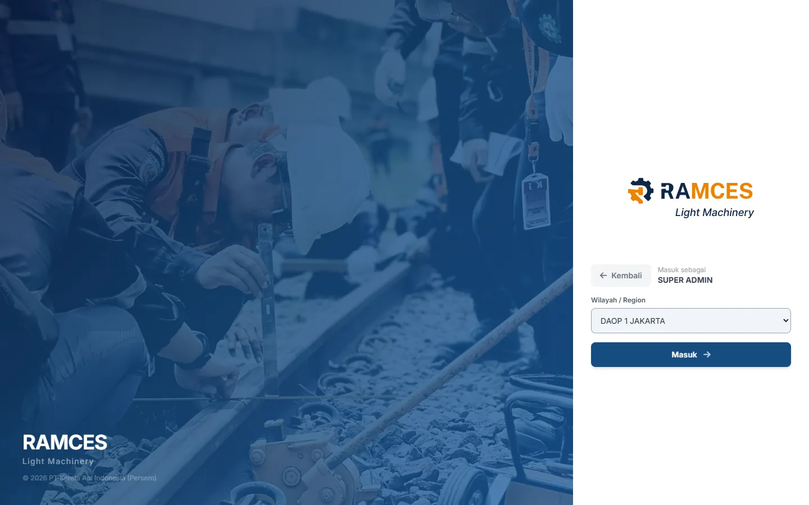

Pilih DAOP/DIVRE tempat Anda bertugas, lalu tekan **Masuk**.

> ### ⚠️ Catatan penting soal keamanan
>
> Versi RAMCES yang Anda pakai sekarang adalah **versi demo**. Saat ini sistem
> **belum meminta kata sandi**, dan kalau nama yang Anda ketik belum terdaftar,
> nama itu akan **langsung dibuatkan akun** dengan peran apa pun yang Anda pilih.
>
> Artinya: siapa pun yang bisa membuka alamat RAMCES dapat masuk sebagai SUPER
> ADMIN hanya dengan mengetik sebuah nama. **Jangan menganggap pembatasan peran
> dan wilayah di sistem ini sebagai pengaman.** Selama masih versi demo, jaga
> agar alamat RAMCES tidak dibagikan ke luar lingkungan yang Anda percaya.
>
> Perbaikannya sudah tercatat sebagai pekerjaan prioritas untuk tim pengembang.

---

## 3. Mengenal Layar RAMCES


Layar RAMCES terbagi tiga bagian.

**Menu samping (kiri).** Semua halaman diakses dari sini, dikelompokkan menjadi:

- **MENU UTAMA** — Dashboard
- **MANAJEMEN ASET** — Kelola Data Alat Kerja, Kelola Inventaris, Kelola Data
  Aset, Pantau Riwayat Aset, Proses Laporan
- **ADMINISTRASI** — Pusat Data, Pulihkan Aset Afkir *(hanya muncul untuk Super Admin)*

Di bagian paling bawah ada **Ganti Tema** untuk berpindah antara tampilan terang
dan gelap. Pilihan ini diingat sistem, jadi tidak perlu diatur ulang tiap masuk.
Kalau Anda belum pernah menekannya, RAMCES **mengikuti pengaturan perangkat Anda** —
ponsel atau komputer yang sudah disetel mode gelap akan langsung membuka RAMCES
dalam mode gelap.

Tombol panah oranye di pojok kiri atas digunakan untuk **melipat menu samping**
supaya area kerja lebih lebar.

**Bilah atas.** Menampilkan nama halaman yang sedang dibuka, jam dan tanggal
berjalan, serta nama dan peran Anda di kanan. Klik nama Anda untuk membuka menu
profil (termasuk tombol **Keluar**).

**Titik hijau kecil** di sebelah jam adalah **indikator koneksi**. Selama titik
itu hijau, RAMCES tersambung ke server dan layar Anda akan **memperbarui diri
sendiri** ketika rekan kerja Anda menyimpan sesuatu — Anda tidak perlu menekan
tombol muat ulang. Kalau titik berubah warna atau muncul tulisan
"Menghubungkan...", sambungan sedang terganggu; sistem akan mencoba menyambung
kembali dengan sendirinya.

### Perbedaan tampilan menurut peran

Menu yang muncul berbeda-beda tergantung peran Anda. Contoh di bawah adalah
tampilan seorang **TEKNISI** — perhatikan menu *Kelola Data Alat Kerja* tidak ada,
karena teknisi tidak mendaftarkan aset baru:

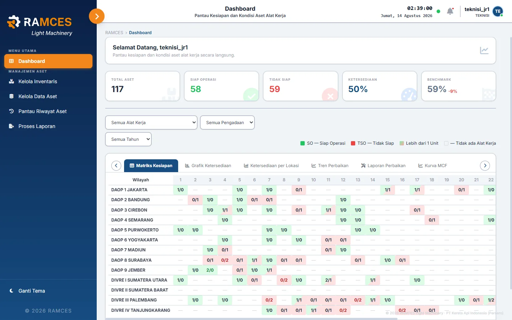

---

## 4. Dashboard — membaca kondisi armada

Dashboard adalah halaman pertama setelah Anda masuk.


### Lima kotak angka di atas

| Kotak | Artinya |
|---|---|
| **TOTAL ASET** | Jumlah aset aktif (yang sudah afkir tidak dihitung) |
| **SIAP OPERASI** | Berapa yang berstatus SO |
| **TIDAK SIAP** | Berapa yang berstatus TSO |
| **KETERSEDIAAN** | Persentase SO dibagi total — makin tinggi makin baik |
| **BENCHMARK** | Target pembanding, beserta selisih Anda terhadap target |

Tiga kotak pilihan di bawahnya (**Semua Alat Kerja**, **Semua Pengadaan**,
**Semua Tahun**) menyaring seluruh isi dashboard sekaligus.

### Matriks Kesiapan

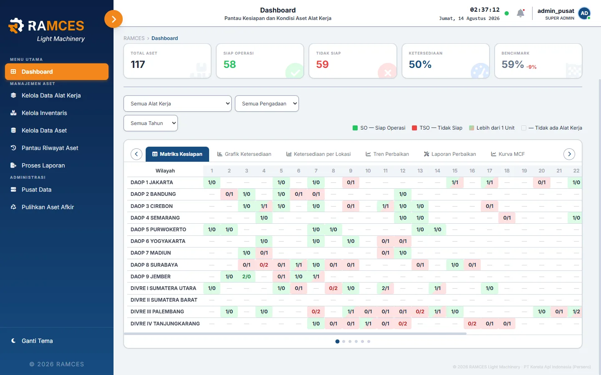

Tabel ini adalah ringkasan paling padat di RAMCES: **satu baris per wilayah**,
**satu kolom per UPT/resort**. Isi setiap kotak dibaca `SO/TSO`.

Contoh: `0/1` berwarna merah berarti di resort itu ada 1 alat dan sedang rusak.
`1/0` berwarna hijau berarti ada 1 alat dan sehat. Tanda `—` berarti tidak ada
alat di resort tersebut. Kolom **Total**, **SO**, dan **TSO** di ujung kanan
merangkum satu wilayah penuh.

### Tab grafik lainnya

Baris tab di atas tabel memuat enam panel: **Matriks Kesiapan**, **Grafik
Ketersediaan**, **Ketersediaan per Lokasi**, **Tren Perbaikan**, **Laporan
Perbaikan**, dan **Kurva MCF**. Gunakan panah ‹ › di kiri dan kanan bila
tabnya tidak muat di layar.

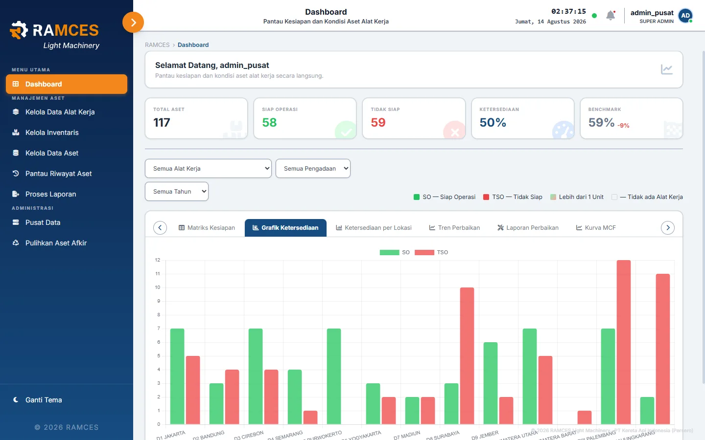

### Laporan Perbaikan

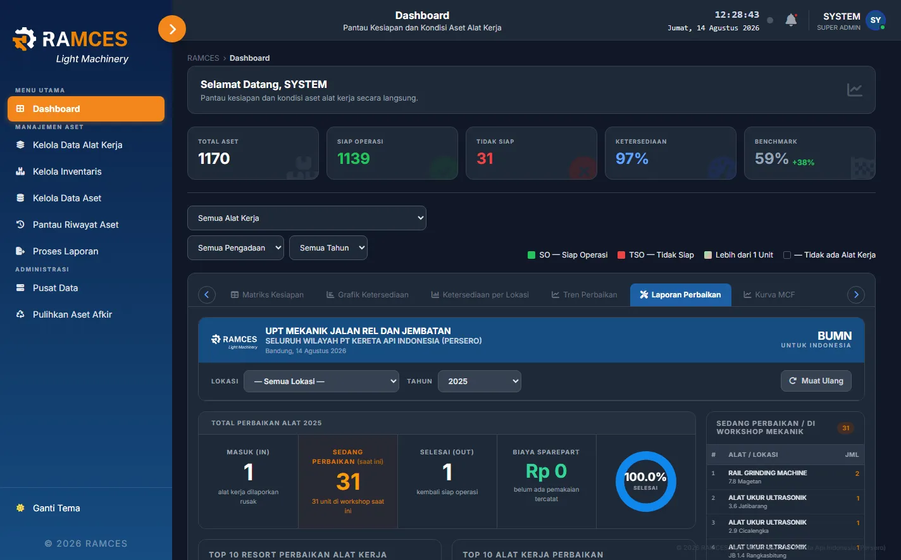

Panel ini meniru laporan perbaikan cetak milik UPT. Tiga angka utamanya:

| Angka | Artinya |
|---|---|
| **Masuk (IN)** | Berapa alat **dilaporkan rusak** sepanjang tahun yang dipilih |
| **Selesai (OUT)** | Berapa alat **selesai diperbaiki** sepanjang tahun yang dipilih |
| **Sedang Perbaikan** | Berapa alat yang **saat ini** masih berstatus TSO |

> **Ini bagian yang paling sering disalahpahami.** *Masuk* dan *Selesai*
> mengikuti tahun yang Anda pilih, tetapi **Sedang Perbaikan adalah hitungan
> hari ini**, bukan angka tahun tersebut — karena itu kotaknya diberi keterangan
> **(saat ini)**. Jadi wajar kalau Anda memilih tahun
> 2022 dan *Sedang Perbaikan* tetap menampilkan angka yang sama dengan tahun
> 2026 — angka itu memang selalu menggambarkan kondisi sekarang.
>
> Kalau Anda memilih **Semua Tahun**, barulah ketiganya cocok:
> `Masuk = Selesai + Diafkir + Sedang Perbaikan`.

Di bawahnya ada **Top 10 Resort Perbaikan Alat Kerja**, **Top 10 Alat Kerja
Perbaikan**, dan **Tren Perbaikan Bulanan**.

### Kurva MCF

Kurva MCF punya **tabnya sendiri** di ujung kanan baris tab, lengkap dengan
penyaring Lokasi dan Tahun. Penyaring di tab ini dan di tab Laporan Perbaikan
selalu seiring — mengubah salah satu ikut mengubah yang lain, jadi Anda tidak
perlu menyetel dua kali.

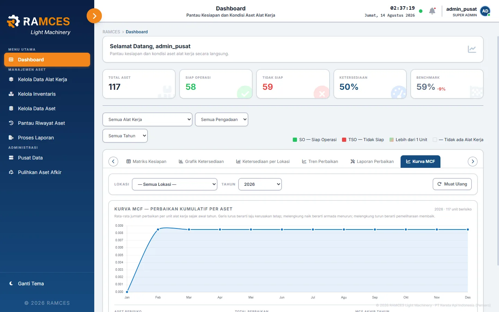

MCF menunjukkan **rata-rata jumlah perbaikan per unit alat** sejak awal tahun.
Cara membacanya sederhana:

- **Garis lurus** — laju kerusakan tetap.
- **Melengkung naik** — kondisi armada memburuk, kerusakan makin sering.
- **Melengkung turun** — pemeliharaan membaik.

---

## 5. Kelola Data Alat Kerja — mendaftarkan aset

Halaman ini untuk **mendaftarkan alat kerja baru** dan melihat daftar lengkapnya.
Tersedia untuk Admin Wilayah dan Super Admin.

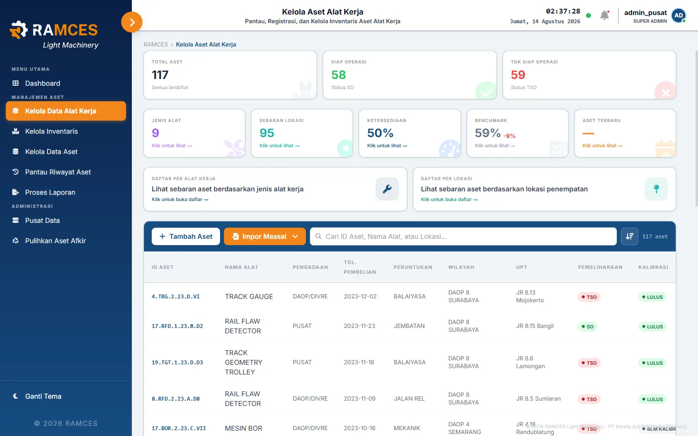

### Menambah satu aset

Tekan tombol **Tambah Aset**.

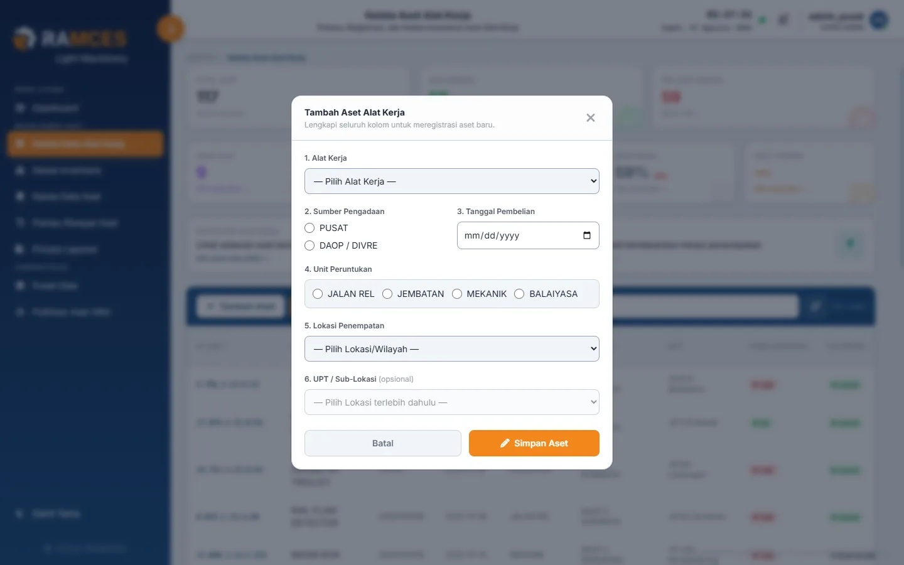

Isi keenam kolom berurutan:

| No. | Kolom | Keterangan |
|---|---|---|
| 1 | **Alat Kerja** | Jenis alat, dipilih dari daftar |
| 2 | **Sumber Pengadaan** | **PUSAT** atau **DAOP / DIVRE** |
| 3 | **Tanggal Pembelian** | Tanggal alat dibeli |
| 4 | **Unit Peruntukan** | JALAN REL, JEMBATAN, MEKANIK, atau BALAIYASA |
| 5 | **Lokasi Penempatan** | DAOP/DIVRE pemilik alat |
| 6 | **UPT / Sub-Lokasi** | Resort tempat alat ditempatkan (opsional) |

Lalu tekan **Simpan Aset**.

> **Semua kolom bertanda wajib harus dipilih.** Kalau ada yang terlewat, sistem
> akan menolak dan menampilkan pesan seperti *"Peruntukan wajib dipilih"*.
> Ini disengaja: keenam kolom tersebut ikut membentuk ID aset, dan ID yang
> terlanjur salah tidak bisa diperbaiki tanpa menulis ulang seluruh riwayatnya.

### Memahami ID Aset

Setiap aset mendapat ID otomatis seperti **`6.RGM.1.24.A.D1`**. ID ini bukan
nomor acak — tiap bagiannya punya arti:

| `6` | `RGM` | `1` | `24` | `A` | `D1` |
|---|---|---|---|---|---|
| Nomor urut | Kode alat | Sumber pengadaan | Tahun beli | Peruntukan | Lokasi |
| ke-6 dari jenis ini | Rail Grinding Machine | 1 = PUSAT, 2 = DAOP/DIVRE | 2024 | A = Jalan Rel | DAOP 1 |

Kode peruntukan: **A** = Jalan Rel, **B** = Jembatan, **C** = Mekanik,
**D** = Balaiyasa.

Karena itu, sekali Anda hafal polanya, Anda bisa membaca asal-usul sebuah alat
hanya dari ID-nya.

### Mendaftarkan banyak aset sekaligus (Impor Massal)

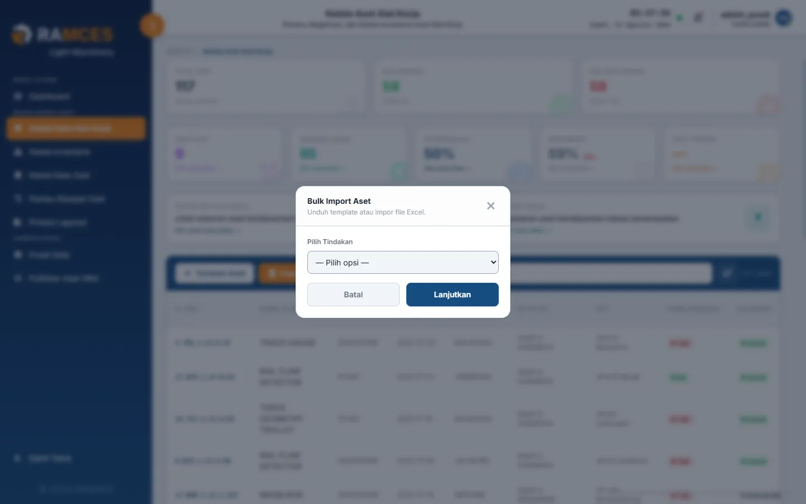

1. Tekan **Impor Massal**.
2. Tekan **Unduh Contoh Excel** — Anda akan mendapat berkas dengan kolom yang
   sudah benar.
3. Isi berkas tersebut di Excel.
4. Tekan **Impor dari Excel**, pilih berkas Anda, lalu proses.

Selalu mulai dari berkas contoh. Kalau nama kolomnya diubah, impor akan gagal.

### Membaca tabel daftar aset

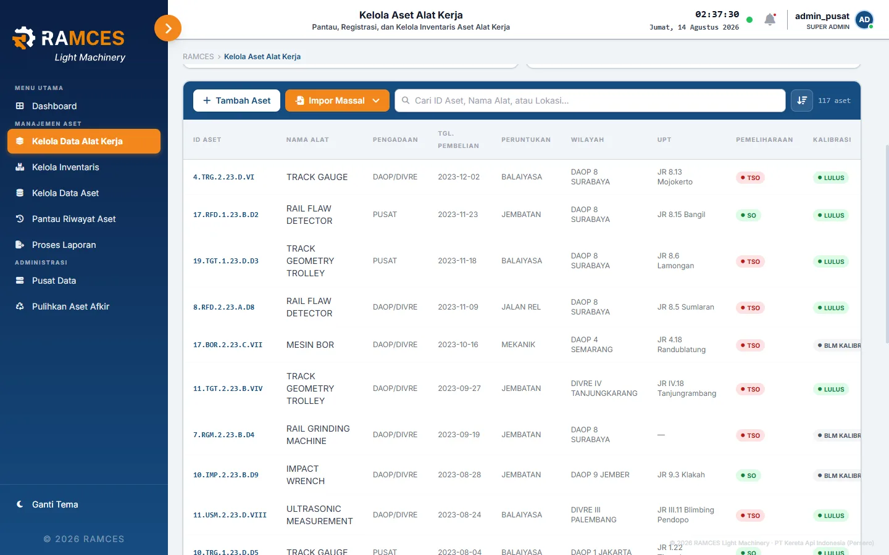

Kolom **Pemeliharaan**, **Kalibrasi**, dan **Mutasi** menampilkan status terakhir
setiap aset sekilas, sedangkan kolom **Aksi** berisi tombol untuk mengubah atau
menghapus.

---

## 6. Kelola Data Aset — mencari dan mencetak

Halaman ini menampilkan seluruh aset dalam bentuk **kartu**, satu kartu per alat.

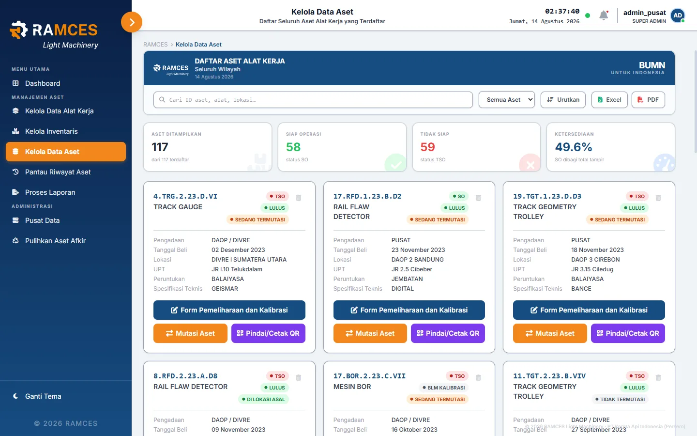

Setiap kartu memuat ID aset, nama alat, lencana status (SO/TSO, status kalibrasi,
status mutasi), data ringkas, dan tiga tombol:

| Tombol | Fungsi |
|---|---|
| **Form Pemeliharaan dan Kalibrasi** | Membuka layar untuk memperbarui kondisi dan mencatat kalibrasi |
| **Mutasi Aset** | Memindahkan alat ke lokasi lain |
| **Pindai/Cetak QR** | Membuat label QR untuk ditempel di alat |

Kotak pilihan **Semua Aset / Aset Saya** menyaring antara seluruh armada dan aset
di wilayah Anda saja.

### Mencari aset

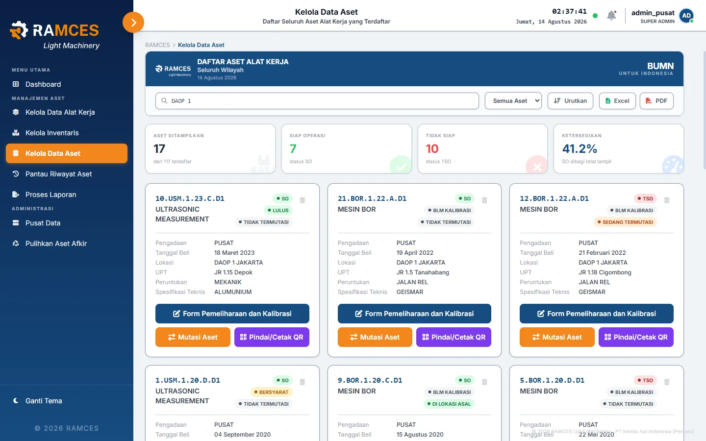

Ketik apa saja di kotak pencarian: ID aset, nama alat, nomor seri, atau nama
lokasi. Hasil menyesuaikan sambil Anda mengetik.

> **Pencarian lokasi bersifat tepat.** Mengetik `DAOP 1` hanya menampilkan aset
> DAOP 1 — **DAOP 10 tidak akan ikut muncul**. Begitu pula `D1` tidak akan
> menarik `D10`. Ini disengaja, supaya hasil pencarian bisa dipercaya. Kalau
> Anda memang ingin melihat DAOP 10, ketiklah `DAOP 10`.
>
> Aturan praktisnya: **apa pun yang tertulis di kartu bisa Anda cari dengan
> mengetik tulisan itu.**

### Mengurutkan dan menyaring

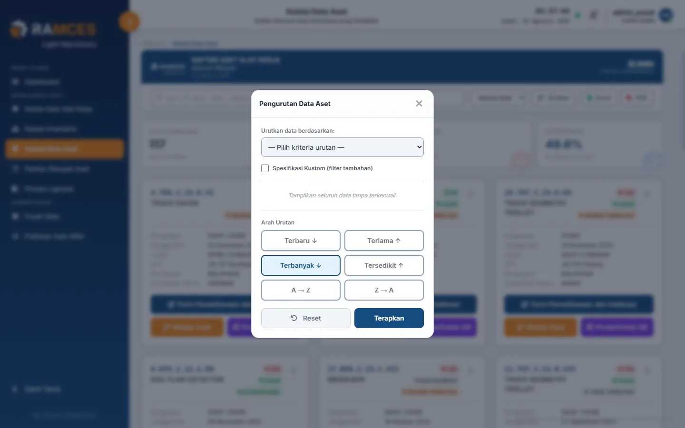

Tekan **Urutkan** untuk membuka panel penyaring lengkap. Anda bisa mengurutkan
berdasarkan Kode ID, Nama/Kode Alat, Pengadaan, Tahun Beli, Peruntukan, atau
Nama/Kode Lokasi — masing-masing dengan penyaring tambahan (rentang tahun,
peruntukan tertentu, lokasi tertentu) dan arah urutan.

Tekan **Terapkan** untuk memakai, atau **Reset** untuk mengembalikan ke semula.

### Mengunduh daftar

Tombol **Excel** dan **PDF** di kanan atas mengunduh daftar yang **sedang
tampil** — termasuk hasil pencarian dan penyaringan Anda. Jadi saring dulu, baru
unduh.

### Mencetak label QR

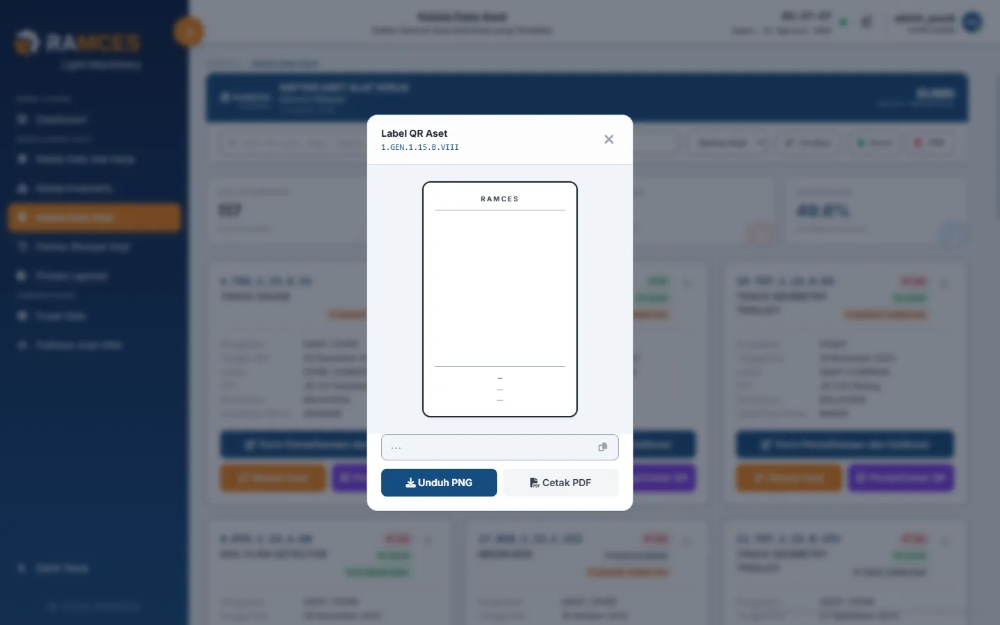

Tekan **Pindai/Cetak QR** pada kartu aset. Akan muncul label berisi kode QR, ID
aset, kode alat, dan kode UPT.

- **Unduh PNG** — untuk disimpan sebagai gambar.
- **Cetak PDF** — untuk langsung dicetak dan ditempel di alat.

Label inilah yang nanti dipindai petugas di lapangan (lihat [bab 13](#13-kartu-aset-lewat-qr-di-lapangan)).

---

## 7. Memperbarui kondisi, kalibrasi, dan mutasi

Inilah pekerjaan harian RAMCES. Masuk lewat tombol **Form Pemeliharaan dan
Kalibrasi** pada kartu aset.

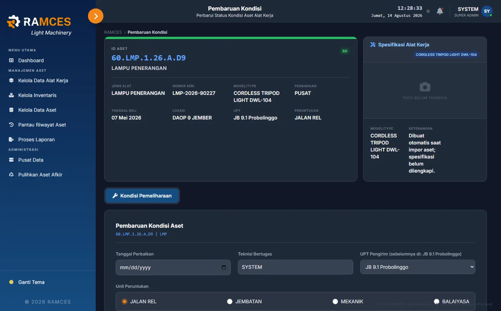

Di bagian atas ditampilkan identitas aset: ID, status, jenis alat, lokasi, UPT,
tanggal beli, peruntukan, dan spesifikasi teknis. Di bawahnya ada dua tab:
**Kondisi Pemeliharaan** dan **Pelaporan Kalibrasi**.

### Melaporkan kondisi (SO / TSO)

Pada tab **Kondisi Pemeliharaan**, isi:

1. **Tanggal Perbaikan** — kapan pemeriksaan/perbaikan dilakukan.
2. **Teknisi Bertugas** — terisi otomatis dengan nama Anda.
3. **UPT Pengirim** — resort yang melaporkan.
4. **Unit Peruntukan** — sesuaikan bila perlu.
5. **Status Kondisi Terkini** — pilih **SO — Siap Operasi** atau
   **TSO — Tidak Siap**.
6. **Catatan Teknisi (Perbaikan)** — tuliskan tindakan yang dilakukan.

Tekan **Simpan Pembaruan**.

Setiap kali Anda menyimpan, RAMCES **menambahkan satu baris riwayat baru** —
data lama tidak pernah ditimpa. Karena itu riwayat sebuah alat selalu utuh dan
bisa ditelusuri dari awal.

> Kalau alat sedang berada di Balaiyasa, laporan perbaikan Anda tetap tercatat
> atas nama DAOP/DIVRE pemilik alat, bukan atas nama bengkel. Anda tidak perlu
> melakukan apa pun — sistem mengurusnya sendiri.

### Mencatat kalibrasi

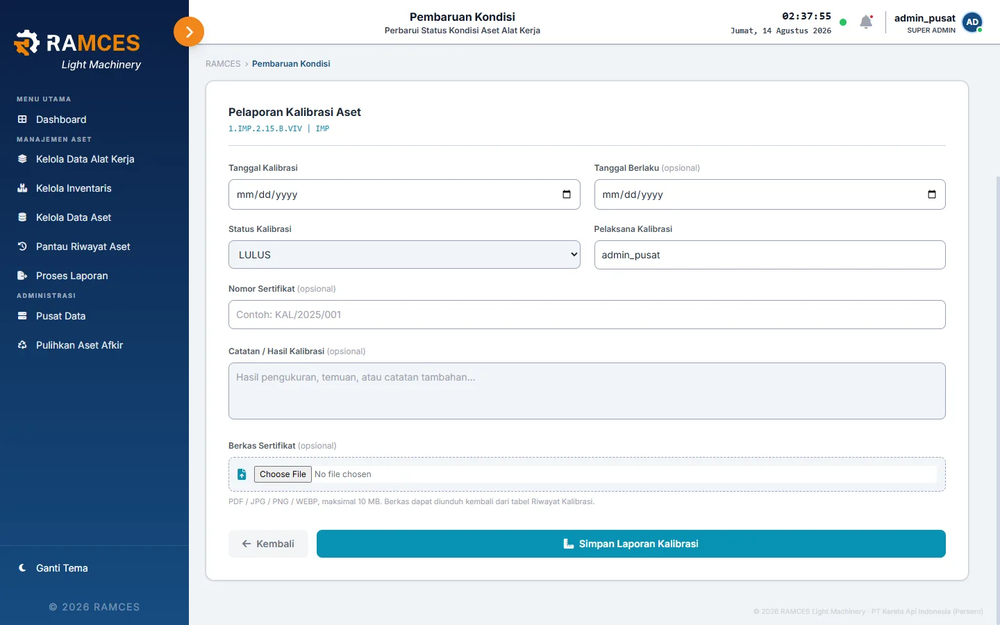

Pindah ke tab **Pelaporan Kalibrasi**, lalu isi:

| Kolom | Keterangan |
|---|---|
| **Tanggal Kalibrasi** | Kapan kalibrasi dilakukan |
| **Tanggal Berlaku** *(opsional)* | Sampai kapan hasilnya berlaku |
| **Status Kalibrasi** | **LULUS**, **BERSYARAT**, atau **GAGAL** |
| **Pelaksana Kalibrasi** | Nama lembaga atau teknisi pelaksana |
| **Nomor Sertifikat** *(opsional)* | Contoh: `KAL/2025/001` |
| **Catatan / Hasil Kalibrasi** *(opsional)* | Hasil pengukuran, temuan, atau catatan tambahan |
| **Berkas Sertifikat** *(opsional)* | Unggah berkas sertifikatnya |

Berkas yang diterima: **PDF, JPG, PNG, atau WEBP, maksimal 10 MB.** Format lain
akan ditolak.

Tekan **Simpan Laporan Kalibrasi**. Sertifikat yang sudah tersimpan dapat diunduh
kembali kapan saja dari tabel Riwayat Kalibrasi.

### Memutasi aset

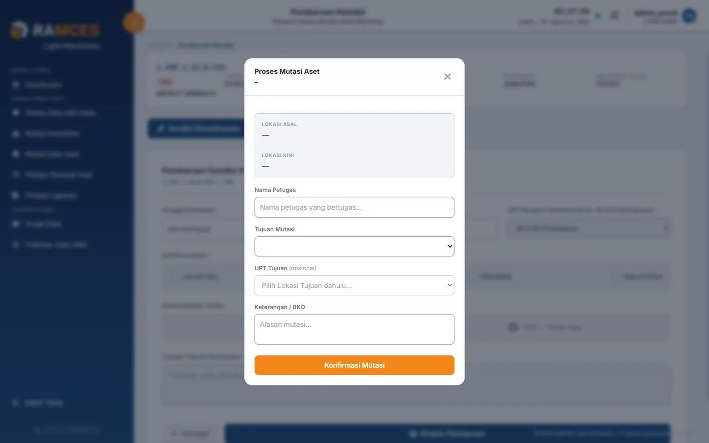

Mutasi dipakai saat alat **berpindah tempat** — misalnya dikirim ke Balaiyasa
untuk perbaikan besar, atau dipinjamkan ke resort lain.

1. **Lokasi Asal** dan **Lokasi Kini** terisi otomatis.
2. Isi **Nama Petugas**.
3. Pilih **Tujuan Mutasi** (DAOP/DIVRE/Balaiyasa tujuan).
4. Pilih **UPT Tujuan** bila ada (opsional).
5. Isi **Keterangan / BKO** — alasan perpindahan.
6. Tekan **Konfirmasi Mutasi**.

> Admin Wilayah hanya bisa memutasi aset **milik wilayahnya sendiri**. Kalau
> muncul pesan *"Hanya bisa memindahkan aset dari wilayah sendiri"*, berarti alat
> tersebut milik wilayah lain — mintalah admin wilayah pemiliknya yang melakukan.

---

## 8. Pantau Riwayat Aset

Halaman ini menampilkan **seluruh kejadian** pada armada, bukan per aset.

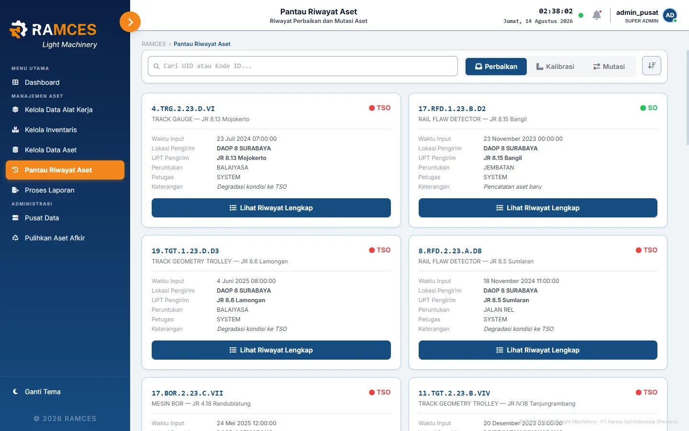

Tersedia tiga tab: **Perbaikan**, **Kalibrasi**, dan **Mutasi**.

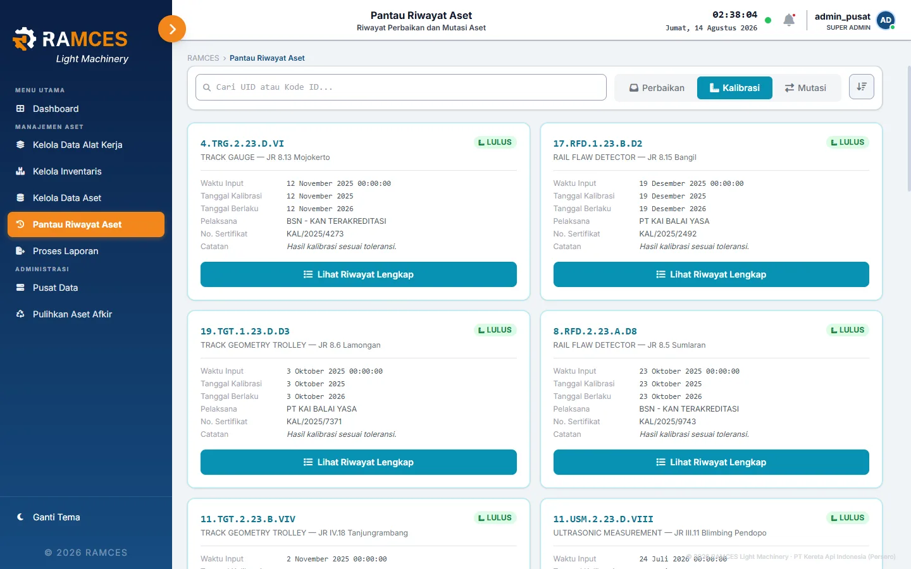

Klik salah satu baris untuk membuka **Detail Riwayat Aset** — di sana riwayat
satu aset ditampilkan lengkap: Riwayat Perbaikan, Riwayat Kalibrasi, dan Jalur
Mutasi, termasuk tombol untuk mengunduh berkas sertifikat.

Kotak pencarian dan tombol urutkan bekerja sama seperti di Kelola Data Aset.

---

## 9. Kelola Inventaris — suku cadang dan gudang

Bagian ini mengelola **suku cadang**, bukan alat kerja.

### Urutannya tidak boleh dibalik

Inventaris RAMCES bekerja berurutan. Kalau dilangkahi, formulirnya tidak akan
mau menyimpan:

```
  Gudang  →  Kategori  →  Suku Cadang  →  Transaksi  →  Stok
```

> **Mulailah selalu dari Gudang.** Kalau belum ada satu pun gudang, formulir
> Transaksi Barang akan menolak setiap penyimpanan — karena sistem tidak tahu
> stoknya mau dimasukkan ke mana.

> **Gudang berdiri sendiri, terpisah dari struktur DAOP/UPT.** Stok disimpan di
> *gudang bernama* (Gudang A, Gudang B, …), bukan di wilayah operasi. Ini
> perbedaan penting dibanding aset, yang justru mengikuti DAOP/UPT.

Halaman ini punya empat tab: **Dashboard**, **Daftar Suku Cadang**,
**Transaksi Barang**, dan **Riwayat Transfer Suku Cadang**.

### Tab Dashboard

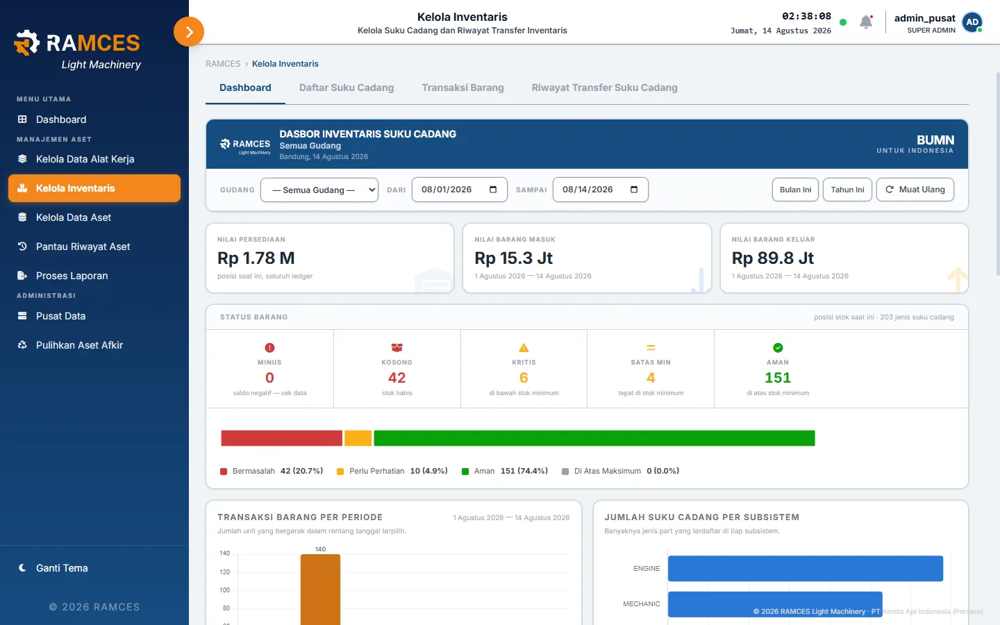

Empat kotak atas menampilkan **Nilai Persediaan** (posisi saat ini, seluruh
ledger), **Nilai Barang Masuk** dan **Nilai Barang Keluar** (periode terpilih),
serta **Status Barang**.

Penyaring **Gudang**, **Dari**, dan **Sampai** di atasnya mengatur periode;
tersedia pintasan **Bulan Ini** dan **Tahun Ini**.

Kotak **Status Barang** mengelompokkan seluruh katalog menjadi empat:

| Kelompok | Artinya |
|---|---|
| **Aman** | Stok di atas batas minimum |
| **Perlu Perhatian** | Stok mendekati batas minimum |
| **Bermasalah** | Stok habis atau di bawah batas minimum |
| **Di Atas Maksimum** | Selalu 0 — batas maksimum belum dipakai di versi ini |

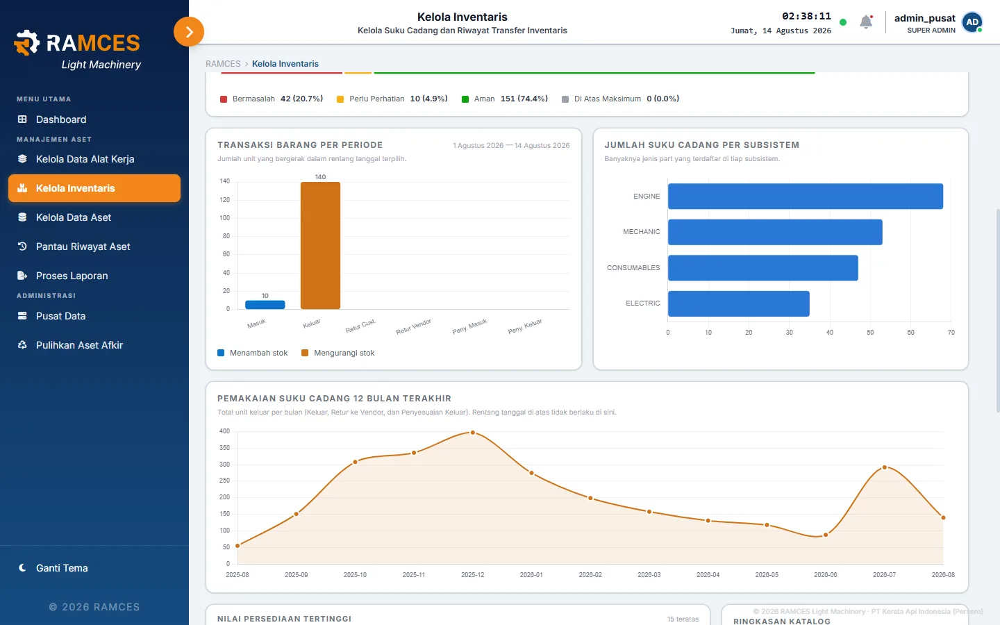

Grafiknya meliputi Transaksi Barang per Periode, Jumlah Suku Cadang per
Subsistem, Pemakaian Suku Cadang 12 Bulan Terakhir, dan Nilai Persediaan
Tertinggi.

> Grafik **Pemakaian Suku Cadang 12 Bulan Terakhir** selalu menampilkan 12 bulan
> terakhir — rentang tanggal di atas **tidak berlaku** untuk grafik yang satu ini.

### Tab Daftar Suku Cadang

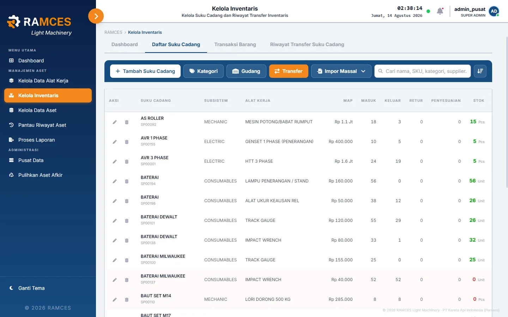

Berisi katalog seluruh suku cadang beserta stok terkini. Tombol di atasnya:

| Tombol | Fungsi |
|---|---|
| **Tambah Suku Cadang** | Mendaftarkan jenis suku cadang baru |
| **Kategori** | Mengelola kategori/subsistem |
| **Gudang** | Mengelola daftar gudang |
| **Transfer** | Memindahkan stok antargudang |
| **Impor Massal** | Mendaftarkan banyak suku cadang dari Excel |

Kolom tabelnya: **SUKU CADANG** (nama beserta SKU), **SUBSISTEM**, **ALAT KERJA**,
**MAP** (harga satuan), lalu **MASUK**, **KELUAR**, **RETUR**, **PENYESUAIAN**,
dan terakhir **STOK**.

Angka pada kolom **STOK** berwarna: **hijau** berarti stok aman, **merah**
berarti stok habis atau di bawah batas minimum yang Anda tetapkan saat
mendaftarkan suku cadang. Kolom **AKSI** di kiri berisi tombol ubah dan hapus.

Saat mendaftarkan suku cadang baru, Anda dapat langsung mengisi **stok awal**.
Pastikan **gudangnya dipilih** — stok awal yang tidak punya gudang tidak akan
terlihat di layar mana pun dan tidak bisa dikeluarkan.

#### Mengelola gudang

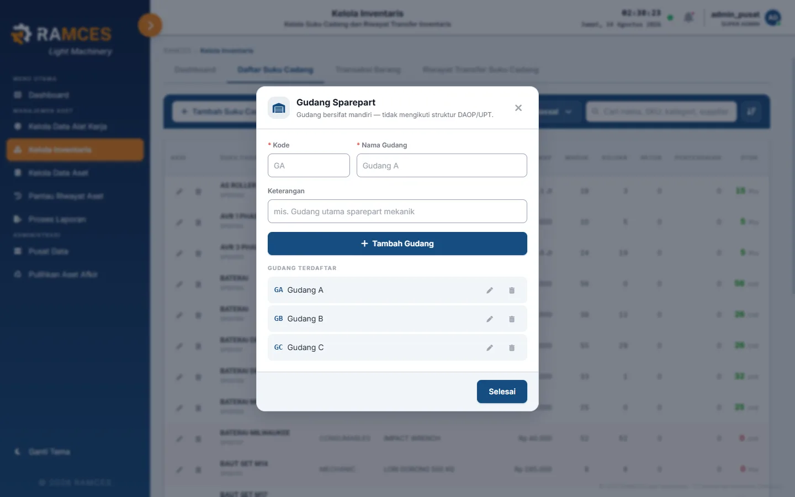

Gudang bisa dikelola dari dua tempat: dari sini (pintasan) dan dari **Pusat Data
▸ Gudang**. Keduanya sama saja — pintasan ini ada supaya Anda tidak perlu keluar
dari halaman Inventaris di tengah pekerjaan.

### Tab Transaksi Barang

Di sinilah stok bertambah dan berkurang.

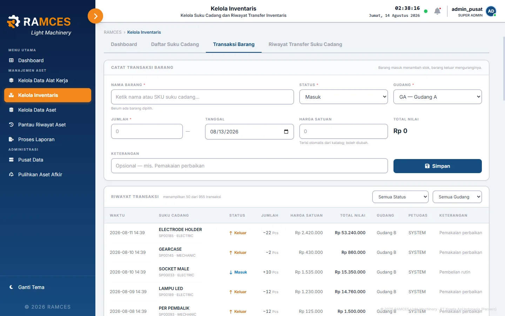

Isi formulir **CATAT TRANSAKSI BARANG**:

| Kolom | Keterangan |
|---|---|
| **NAMA BARANG** \* | Ketik nama atau SKU, lalu pilih dari daftar |
| **STATUS** \* | Jenis pergerakan (lihat tabel di bawah) |
| **GUDANG** \* | Gudang mana yang stoknya berubah |
| **JUMLAH** \* | Banyaknya unit |
| **TANGGAL** | Tanggal transaksi |
| **HARGA SATUAN** | Terisi otomatis dari katalog; boleh diubah |
| **TOTAL NILAI** | Dihitung otomatis |
| **KETERANGAN** | Misalnya "Pemakaian perbaikan" |

Enam jenis pergerakan, dan pengaruhnya terhadap stok:

| Status | Pengaruh | Dipakai untuk |
|---|---|---|
| **Masuk** | ➕ menambah | Pembelian / penerimaan barang |
| **Retur dari Customer** | ➕ menambah | Barang kembali dari pemakai |
| **Penyesuaian Masuk** | ➕ menambah | Koreksi stok opname (lebih) |
| **Keluar** | ➖ mengurangi | Pemakaian untuk perbaikan |
| **Retur ke Vendor** | ➖ mengurangi | Barang dikembalikan ke pemasok |
| **Penyesuaian Keluar** | ➖ mengurangi | Koreksi stok opname (kurang) |

Tekan **Simpan**.

> RAMCES **tidak akan mengizinkan stok menjadi minus.** Kalau Anda mencoba
> mengeluarkan lebih banyak daripada yang ada, muncul pesan *"Stok tidak
> mencukupi. Tersedia N Pcs."* Jumlah nol atau minus juga ditolak.

Di bawah formulir ada **Riwayat Transaksi** yang bisa disaring per status dan
per gudang, dengan tombol **Muat lebih banyak** untuk melihat data lama.

### Hal-hal kecil yang sering ditanyakan

Beberapa perilaku modul ini tidak terlihat dari layar, tetapi menentukan hasil:

| Hal | Yang perlu diketahui |
|---|---|
| **Kode SKU** | Kosongkan saja saat menambah suku cadang — sistem membuatkannya otomatis (`SP00001`, `SP00002`, …). **SKU tidak bisa diubah setelah tersimpan.** |
| **Harga satuan** | Terisi otomatis dari katalog, tetapi boleh Anda timpa. Harga yang Anda pakai **dibekukan pada baris transaksi itu**, jadi memperbarui harga katalog tidak mengubah nilai transaksi lama. |
| **Kolom Masuk / Keluar / Retur / Penyesuaian** di tabel | Itu **total sepanjang riwayat**, bukan angka periode yang sedang dipilih. |
| **Nilai Persediaan** di Dashboard | Selalu posisi **saat ini** — tidak terpengaruh rentang tanggal. Hanya Nilai Barang Masuk dan Keluar yang mengikuti periode. |
| **Filter Gudang di Dashboard** | Ikut membatasi tab Daftar Suku Cadang. Itulah satu-satunya tempat cakupan gudang dipilih. |
| **Menghapus kategori** | Suku cadang di dalamnya **tidak ikut terhapus** — hanya lepas dari kategori dan kolom subsistemnya kosong. Untuk memperbaiki salah ketik, pakai tombol ubah, jangan hapus lalu buat ulang. |
| **Menghapus suku cadang** | Ditolak bila barang sudah punya riwayat pergerakan, supaya buku besar tidak menjadi yatim. |
| **Menghapus gudang** | Gudang yang punya riwayat stok akan **dinonaktifkan**, bukan dihapus. |
| **Mengubah suku cadang** | Kolom stok awal dan gudang dikunci saat mengubah — stok hanya berubah lewat Transaksi Barang. |
| **Impor massal** | Nama kategori harus sama persis dengan yang terdaftar; kategori tidak dibuat otomatis dari berkas. Stok awal tidak ikut diimpor. |

### Siapa boleh apa di modul ini

| Peran | Kewenangan |
|---|---|
| **SUPER ADMIN** | Seluruh modul, termasuk menghapus gudang secara permanen |
| **ADMIN WILAYAH** | Kelola katalog, kategori, gudang, dan seluruh pergerakan stok — tetapi tidak bisa menghapus gudang permanen |
| **TEKNISI** | Mencatat pergerakan dan transfer stok (merekalah yang memakai barangnya). Tidak bisa mengubah katalog atau kategori |

### Kalau ada yang tidak beres di Inventaris

| Gejala | Penyebab & solusi |
|---|---|
| Dropdown gudang kosong, tombol simpan tidak bekerja | Belum ada gudang sama sekali. Buat gudang lebih dulu. |
| Baris bantuan menyebut ada stok, tapi pengeluaran ditolak | Stoknya ada **di gudang lain**. Periksa dropdown **GUDANG** pada formulir — angka bantuan mengikuti gudang yang sedang dipilih di situ. |
| Stok awal tidak muncul setelah memfilter gudang | Data lama tersimpan tanpa gudang. Catat **Penyesuaian Masuk** ke gudang yang benar. |
| Semua suku cadang berstatus kritis | Buku besar masih kosong; belum ada transaksi sama sekali. |
| Banyak baris gagal saat impor Excel | Nama kategori tidak dikenal, atau SKU yang diisi manual sudah dipakai. |
| Tombol hapus muncul tapi ditolak server | Peran Anda tidak berwenang — lihat tabel kewenangan di atas. |

### Tab Riwayat Transfer Suku Cadang

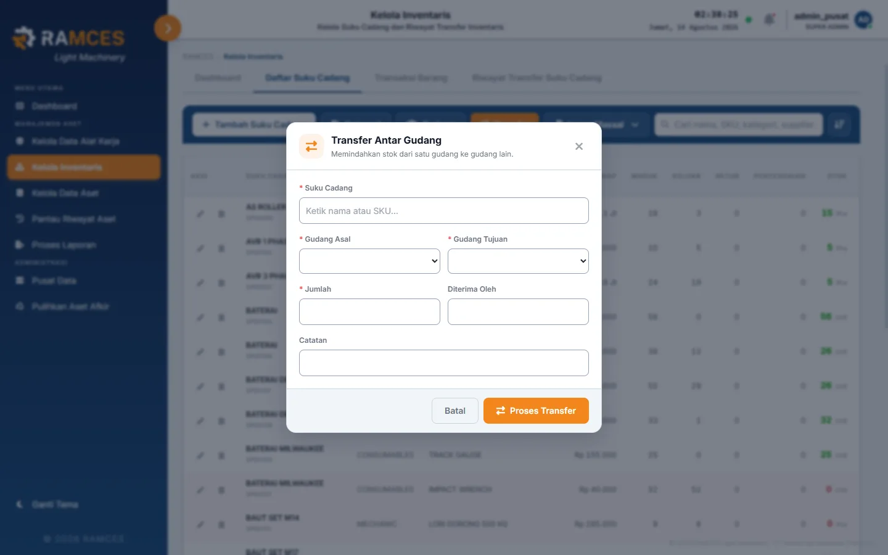

Transfer memindahkan stok **dari satu gudang ke gudang lain**. Pilih suku
cadangnya, jumlahnya, gudang asal, dan gudang tujuan.

Sistem menolak transfer ke gudang yang sama, dan menolak jumlah yang melebihi
stok di gudang asal.

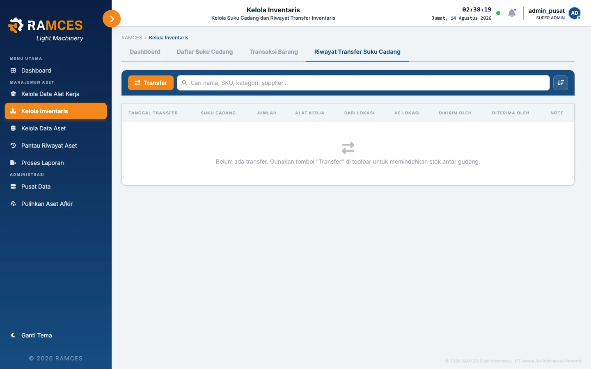

---

## 10. Proses Laporan — ekspor Excel dan PDF

Halaman ini untuk membuat laporan resmi yang bisa dicetak atau dikirim.

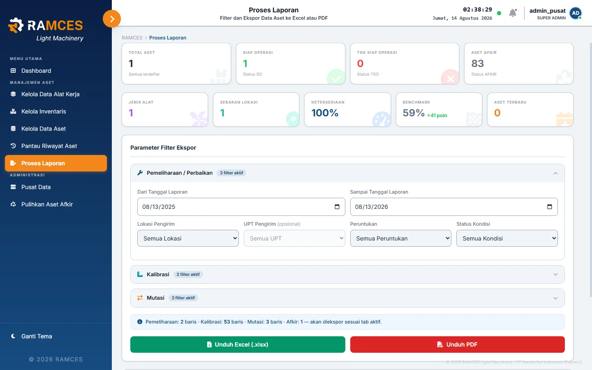

Pilih dulu jenis laporannya — **Pemeliharaan / Perbaikan**, **Kalibrasi**, atau
**Mutasi** — lalu isi penyaringnya:

| Jenis laporan | Penyaring yang tersedia |
|---|---|
| **Pemeliharaan** | Rentang tanggal laporan, Lokasi Pengirim, UPT Pengirim, Peruntukan, Status Kondisi |
| **Kalibrasi** | Rentang tanggal kalibrasi, Status Kalibrasi (LULUS/BERSYARAT/GAGAL), No. Sertifikat |
| **Mutasi** | Rentang tanggal mutasi, Lokasi Asal, UPT Asal, Lokasi Tujuan, UPT Tujuan |

Hasilnya langsung ditampilkan sebagai pratinjau di bawah:

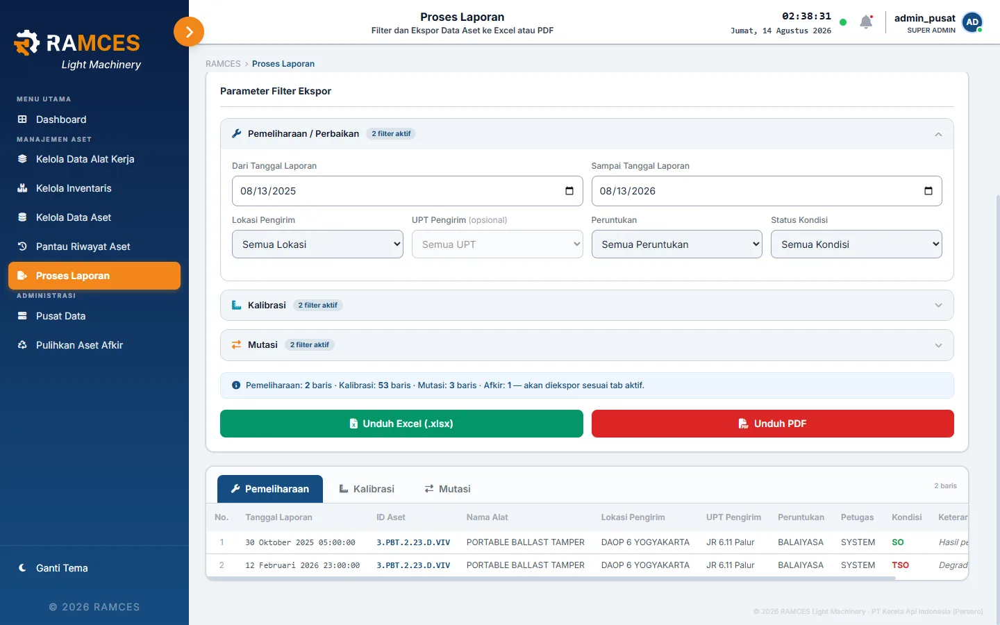

Periksa dulu pratinjaunya, baru tekan **Unduh Excel (.xlsx)** atau **Unduh PDF**.
Berkas dibuat di komputer Anda sendiri, jadi prosesnya cepat dan tidak membebani
server.

---

## 11. Pusat Data (khusus Super Admin)

Pusat Data adalah tempat mengelola **data induk** — daftar acuan yang dipakai
seluruh sistem. Menu ini hanya muncul untuk Super Admin.

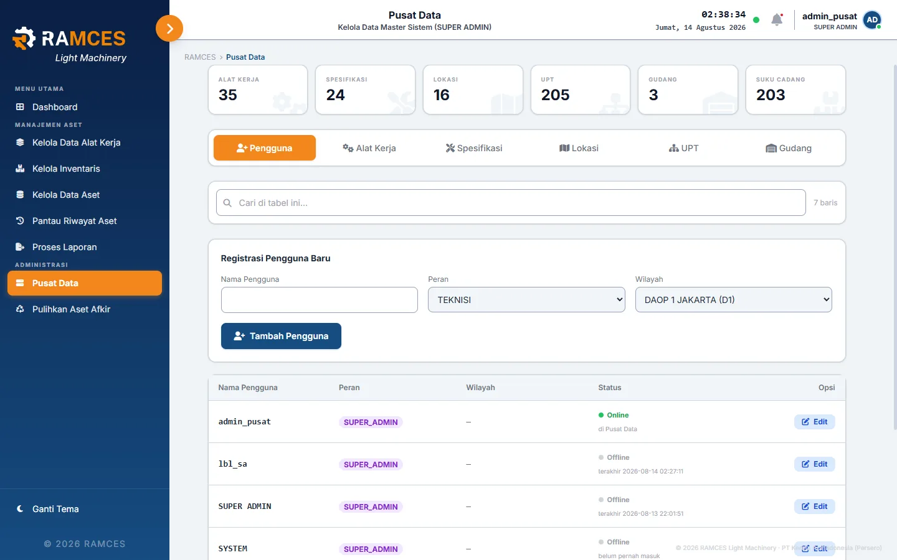

Ada enam tab:

| Tab | Isinya |
|---|---|
| **Pengguna** | Daftar akun, perannya, dan wilayahnya |
| **Alat Kerja** | Jenis alat beserta kodenya (GEN, RGM, TGT, …) |
| **Spesifikasi** | Spesifikasi teknis per varian alat |
| **Lokasi** | DAOP, DIVRE, PUSAT, BALAIYASA |
| **UPT** | Resort di bawah tiap lokasi |
| **Gudang** | Daftar gudang penyimpanan suku cadang |

### Pengguna

Isi **Nama Pengguna**, pilih **Peran** (TEKNISI / ADMIN WILAYAH / SUPER ADMIN)
dan **Wilayah**, lalu tekan **Tambah Pengguna**.

### Lokasi dan UPT

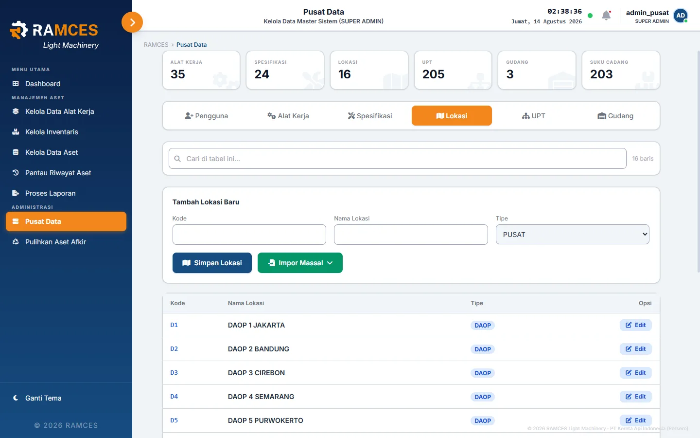

Untuk **Lokasi** isi Kode, Nama Lokasi, dan Tipe (PUSAT/DAOP/DIVRE/BALAIYASA).
Untuk **UPT** isi Kode UPT, Nama UPT, dan **Induk Lokasi**.

> Kode UPT harus mengikuti pola yang sudah ada (`JR1.7`, `JRIII.15`), karena dari
> kode itulah sistem menentukan UPT tersebut milik DAOP/DIVRE yang mana.

### Spesifikasi Teknis

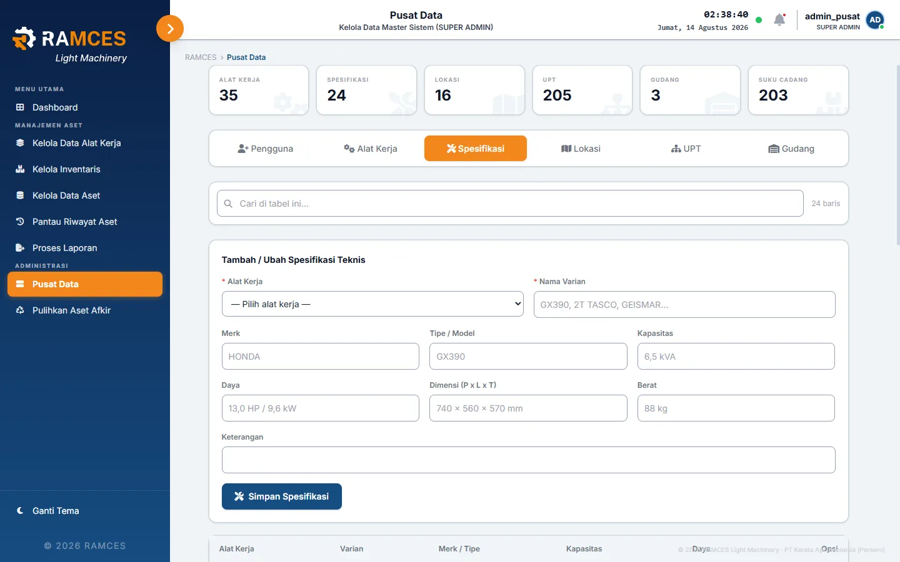

Isi Nama Varian, Merk, Tipe/Model, Kapasitas, Daya, Dimensi (P x L x T), Berat,
dan Keterangan. Spesifikasi inilah yang muncul di kartu aset dan di kartu QR.

### Gudang

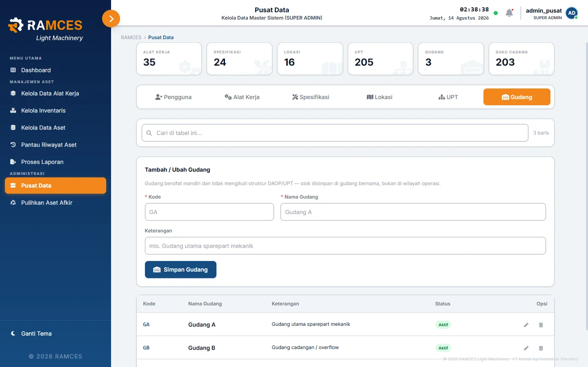

Isi Kode dan Nama Gudang. Ingat, gudang **tidak mengikuti struktur DAOP/UPT**.

> Menghapus data induk yang sudah dipakai umumnya tidak diizinkan atau hanya
> akan **dinonaktifkan**, supaya riwayat lama tidak menjadi yatim. Ini disengaja.

---

## 12. Pulihkan Aset Afkir

**Afkir** berarti aset dihapus dari daftar aktif. Aset afkir tidak lagi masuk
hitungan Total Aset dan tidak muncul di Kelola Data Aset — tetapi **datanya tidak
dihapus**, dan bisa dikembalikan.

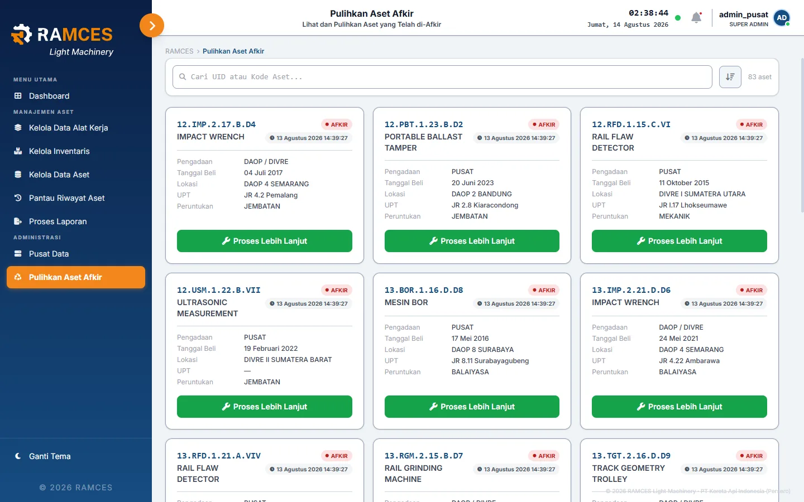

Cari asetnya, lalu tekan **Proses Lebih Lanjut** pada kartunya untuk
mengembalikan aset ke status aktif. Halaman ini hanya untuk Super Admin.

---

## 13. Kartu Aset lewat QR (di lapangan)

Setiap alat kerja bisa ditempeli label QR (lihat [bab 6](#mencetak-label-qr)).
Ketika dipindai dengan kamera ponsel, label itu membuka **Kartu Aset** —
halaman ringkas yang dirancang untuk layar ponsel.

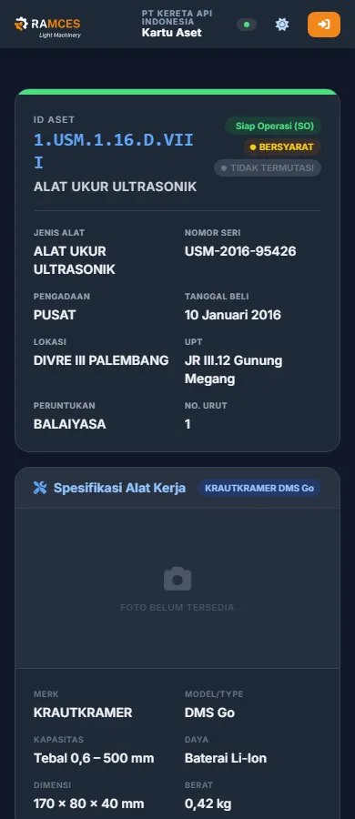

Tanpa perlu masuk, siapa pun yang memindai langsung melihat:

- **ID Aset** dan **status** (Siap Operasi / Tidak Siap, status kalibrasi, posisi
  mutasi)
- **Jenis Alat**, **Nomor Seri**, **Pengadaan**, **Tanggal Beli**
- **Lokasi**, **UPT**, **Peruntukan**, **No. Urut**
- **Spesifikasi Alat Kerja** — merk, tipe, kapasitas, daya, dimensi, berat
- **Umur Aset** dan **Pemeliharaan Terakhir**

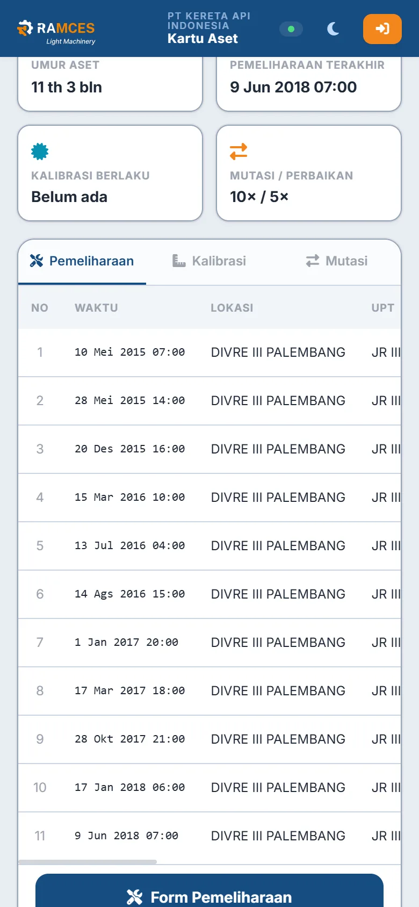

Di bawahnya ada tab **Pemeliharaan**, **Kalibrasi**, dan **Mutasi**. Isi ketiga
tab itu — dan semua formulir pelaporan — **baru terbuka setelah Anda masuk**.
Sebelum masuk akan tertulis *"Login untuk melihat riwayat pemeliharaan."*

Setelah Anda masuk, muncul **titik hijau bertuliskan "Terhubung"** di bilah
atas. Selama titik itu menyala, kantor melihat Anda sebagai **sedang online**
di *Pusat Data ▸ Pengguna*, dengan keterangan layar **"Kartu Aset (QR)"** —
jadi rekan di kantor tahu Anda sedang berada di depan alatnya. Kalau sinyal
lapangan putus, titiknya berubah merah dan sistem menyambung ulang sendiri.
Pemindaian tanpa masuk tetap anonim dan tidak tercatat sebagai online.

Setelah masuk lewat tombol di pojok kanan atas, petugas dapat langsung mengisi
dari ponsel:

- **Form Pemeliharaan** — Tanggal Pemeriksaan, Nama Petugas, Lokasi (DAOP/Induk),
  UPT Pelapor, Kondisi Alat Pasca Pemeliharaan (✅ SO / ❌ TSO), dan Keterangan /
  Uraian Pekerjaan.
- **Form Kalibrasi** — sama seperti di layar besar, lengkap dengan unggah berkas.
- **Proses Mutasi Aset** — Tujuan Mutasi, UPT Tujuan, Keterangan / BKO.

Inilah cara tercepat melaporkan dari lapangan: **pindai QR di alatnya, masuk,
isi, simpan.** Tidak perlu mencari asetnya satu per satu di daftar.

---

## 14. Tips dan pemecahan masalah

### Pertanyaan yang sering muncul

**"Stok suku cadang saya sudah dimasukkan, tapi tidak kelihatan."**
Kemungkinan besar stok awal tersimpan tanpa memilih **Gudang**. Semua layar
inventaris menghitung stok **per gudang**, jadi stok tanpa gudang tidak akan
muncul di mana pun dan tidak bisa dikeluarkan. Catat ulang lewat **Transaksi
Barang** dengan status **Masuk** dan gudang yang benar.

**"Saya tidak bisa menyimpan transaksi barang sama sekali."**
Periksa apakah sudah ada gudang terdaftar. Tanpa gudang, formulir menolak semua
penyimpanan. Buat gudang lebih dulu lewat tombol **Gudang** atau **Pusat Data ▸
Gudang**.

**"Muncul pesan 'Stok tidak mencukupi'."**
Anda mencoba mengeluarkan lebih banyak dari yang tersedia **di gudang tersebut**.
Stok dihitung per gudang — bisa jadi barangnya ada, tapi di gudang lain. Gunakan
**Transfer** untuk memindahkannya lebih dulu.

**"Aset baru tidak bisa disimpan."**
Pastikan **semua** kolom sudah dipilih, terutama **Sumber Pengadaan** dan **Unit
Peruntukan**. Keduanya berupa pilihan bulat yang mudah terlewat.

**"Muncul pesan 'Hanya bisa ... wilayah Anda'."**
Anda masuk sebagai Admin Wilayah dan alat tersebut milik wilayah lain. Hanya
Super Admin atau admin wilayah pemiliknya yang boleh mengubahnya.

**"Mencari 'DAOP 1' tapi DAOP 10 tidak muncul."**
Itu memang perilaku yang benar dan disengaja. Ketik `DAOP 10` untuk DAOP 10.

**"Angka 'Sedang Perbaikan' tidak berubah walaupun tahunnya saya ganti."**
Benar. *Sedang Perbaikan* selalu menghitung kondisi **hari ini**, bukan tahun
yang dipilih. Lihat penjelasan di [bab 4](#laporan-perbaikan).

**"Sertifikat kalibrasi tidak bisa diunggah."**
Format yang diterima hanya **PDF, JPG, PNG, WEBP**, maksimal **10 MB**.

**"Layar saya tidak memperbarui data terbaru."**
Periksa indikator titik di sebelah jam. Kalau tidak hijau, sambungan sedang
terganggu — sistem akan menyambung sendiri. Kalau perlu, muat ulang halaman.

### Kotak konfirmasi

Setiap tindakan penting — menyimpan perubahan, menghapus, keluar — selalu
meminta konfirmasi lebih dulu:

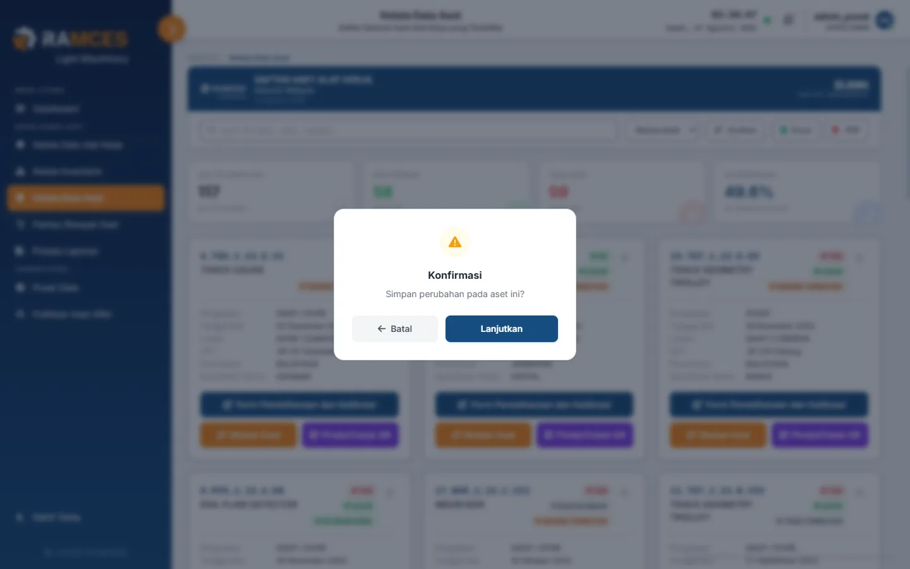

Tekan **Lanjutkan** untuk meneruskan, atau **Batal** untuk membatalkan. Menekan
tombol `Esc` sama artinya dengan menekan **Batal** — jadi tidak ada tindakan yang
terlanjur berjalan hanya karena Anda menutup jendelanya.

### Kebiasaan yang memudahkan

- **Tekan `Esc`** untuk menutup jendela/formulir yang sedang terbuka.
- **Saring dulu, baru unduh.** Tombol Excel/PDF selalu mengikuti apa yang sedang
  tampil di layar.
- **Tulis keterangan yang jelas.** Kolom Catatan/Keterangan adalah satu-satunya
  tempat menjelaskan *kenapa*; angka saja tidak bercerita.
- **Jangan menghapus aset yang salah ketik — perbaiki saja.** Menghapus akan
  menghilangkan seluruh riwayatnya.
- **Gunakan Ganti Tema** kalau bekerja malam hari; pilihan Anda diingat sistem.

---

## 15. Glosarium

| Istilah | Arti |
|---|---|
| **Afkir** | Aset yang dihapus dari daftar aktif, tetapi datanya tetap tersimpan |
| **Aset / Alat Kerja** | Mesin yang dikelola RAMCES, punya ID dan riwayat sendiri |
| **Balaiyasa** | Bengkel perbaikan; bukan wilayah operasi |
| **Benchmark** | Angka target pembanding untuk ketersediaan |
| **BKO** | Bawah Kendali Operasi — keterangan pada mutasi |
| **DAOP** | Daerah Operasi (DAOP 1 – DAOP 9, wilayah Jawa) |
| **DIVRE** | Divisi Regional (wilayah Sumatera) |
| **Gudang** | Tempat penyimpanan suku cadang; berdiri sendiri, tidak mengikuti DAOP/UPT |
| **ID Aset** | Kode unik aset, contoh `6.RGM.1.24.A.D1` |
| **Kalibrasi** | Pemeriksaan ketepatan alat oleh lembaga berwenang |
| **Ketersediaan** | Persentase aset berstatus SO terhadap total |
| **MCF** | *Mean Cumulative Function* — rata-rata perbaikan kumulatif per unit |
| **Mutasi** | Perpindahan aset dari satu lokasi ke lokasi lain |
| **Pemeliharaan** | Pemeriksaan/perbaikan yang menghasilkan status SO atau TSO |
| **Pengadaan** | Sumber pembelian aset: PUSAT atau DAOP/DIVRE |
| **Peruntukan** | Unit pengguna alat: Jalan Rel, Jembatan, Mekanik, atau Balaiyasa |
| **SKU** | Kode katalog suku cadang |
| **SO** | Siap Operasi — alat sehat dan boleh dipakai |
| **Stok minimum** | Batas bawah stok; di bawahnya muncul peringatan |
| **Subsistem** | Pengelompokan suku cadang (Electric, Mechanic, …) |
| **Suku Cadang** | Onderdil habis pakai; dihitung per gudang |
| **TSO** | Tidak Siap Operasi — alat rusak atau sedang diperbaiki |
| **UPT / Resort** | Unit kerja di bawah DAOP/DIVRE, contoh `JR 1.7 Rangkasbitung` |
| **Varian** | Spesifikasi teknis sebuah model alat |

---

*Panduan ini menjelaskan RAMCES rev0.4.0-beta. Untuk catatan pengembangan dan
rencana perbaikan, lihat [RENCANA-PENGEMBANGAN.md](RENCANA-PENGEMBANGAN.md).*
